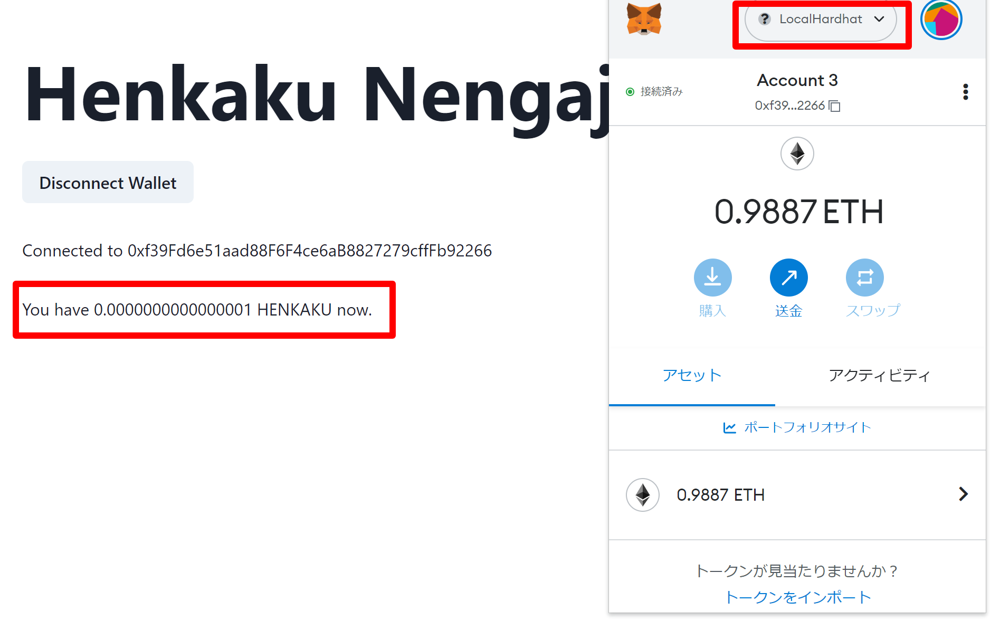

# LocalNode でフロントエンドとつなぐ方法

## コントラクト側の環境変数を設定

コントラクトのルートディレクトリで.env.example を.env としてコピー

```
$ cp ./.env.example ./.env
```

**LOCAL_PRIVATE_KEY**  
ローカルノードを立ち上げたときに出力されたウォレットのどれでも好きなもの。.env.exampleに一番目のアドレスのPrivateKeyをいれてます。

**LOCAL_USERS_ADDRESSES**  
自分で開発に使いたいウォレットアドレスをカンマ(,)区切りで入れてください。ここに入力したアドレスにローカルチェーン上の HenkakuV2 トークンをミントします。

例

```
LOCAL_USERS_ADDRESSES=0xf39Fd6e51aad88F6F4ce6aB8827279cffFb92266,0x70997970C51812dc3A010C7d01b50e0d17dc79C8
```

## ローカルノードの立ち上げ

コントラクトのルートディレクトリで

```
$ yarn localnode
```

コンソールには以下のように出力されるはずです。Hardhat のローカルノードを用いて自分の PC 上にチェーンを起動し、20 個のアカウントがつくられます。毎回起動しても同じアドレスです。この PrivateKey は特に知られても問題ありませんが、一応かくしてます。

```
Started HTTP and WebSocket JSON-RPC server at http://127.0.0.1:8545/

Accounts
========

WARNING: These accounts, and their private keys, are publicly known.
Any funds sent to them on Mainnet or any other live network WILL BE LOST.

Account #0: 0xf39Fd6e51aad88F6F4ce6aB8827279cffFb92266 (10000 ETH)
Private Key: 0xac097------

Account #1: 0x70997970C51812dc3A010C7d01b50e0d17dc79C8 (10000 ETH)
Private Key: 0x59c69------

Account #2: 0x3C44CdDdB6a900fa2b585dd299e03d12FA4293BC (10000 ETH)
Private Key: 0x5de41------

~~~~~~~~~~~~~
```

## ローカルチェーンと開発用アドレスを自分の MetaMask にインポート

### ローカルチェーンをインポート

Polygon などデフォルトで入っていないチェーンを追加する要領でローカルチェーンを MetaMask に追加してください。[やり方](https://medium.com/@kaishinaw/connecting-metamask-with-a-local-hardhat-network-7d8cea604dc6#bc39)

### 開発用アドレスをインポート

ローカルノードを立ち上げたときに出力されたウォレットのどれでも好きなものの**Private Key**をつかってウォレットインポートしてください。[やり方](https://metamask.zendesk.com/hc/en-us/articles/360015489331-How-to-import-an-account#:~:text=Importing%20using%20a%20private%20key&text=Click%20the%20circle%20icon%20at,key%20and%20click%20%E2%80%9CImport%E2%80%9D.)

## コントラクトのデプロイ

```
$ yarn deploy:local
```

こんな感じでデプロイされたコントラクトアドレスが出力されるはずです。

```
HenkakuV2: 0x5FbDB2315678afecb367f032d93F642f64180aa3
Ticket  : 0xDc64a140Aa3E981100a9becA4E685f962f0cF6C9
```

## フロントエンド側の環境変数を設定

**フロントエンド**のルートディレクトリで.env.example を.env.local としてコピー

```
$ cp ./.env.sample ./.env.local
```

**NEXT_PUBLIC_CHAIN_ID**  
Hardhat のローカルチェーンのチェーン ID は**31337**です。

**NEXT_PUBLIC_CONTRACT_HENKAKUV2_ADDRESS**  
コントラクトデプロイしたときに出力された HenkakuV2 のアドレス

**NEXT_PUBLIC_CONTRACT_TICKET_ADDRESS**  
コントラクトデプロイしたときに出力された Ticket のアドレス

## フロントエンド起動

フロントエンドのルートディレクトリで

```
$ yarn dev
```

こんな感じのものが出力されるはず

```
$ next dev
ready - started server on 0.0.0.0:3000, url: http://localhost:3000
info  - Loaded env from /home/yu23ki14/apps/henkaku/henkaku-ticket-frontend/.env.local
event - compiled client and server successfully in 1460 ms (969 modules)
```

## フロントエンドにアクセスして、LocalChain に接続して HenkakuV2 トークンがミントされているか確認

MetaMask に追加したローカルチェーンに接続している状態で、ウォレットコネクトをすると Henkaku のバランスが表示されるはずです。



### 以上！
